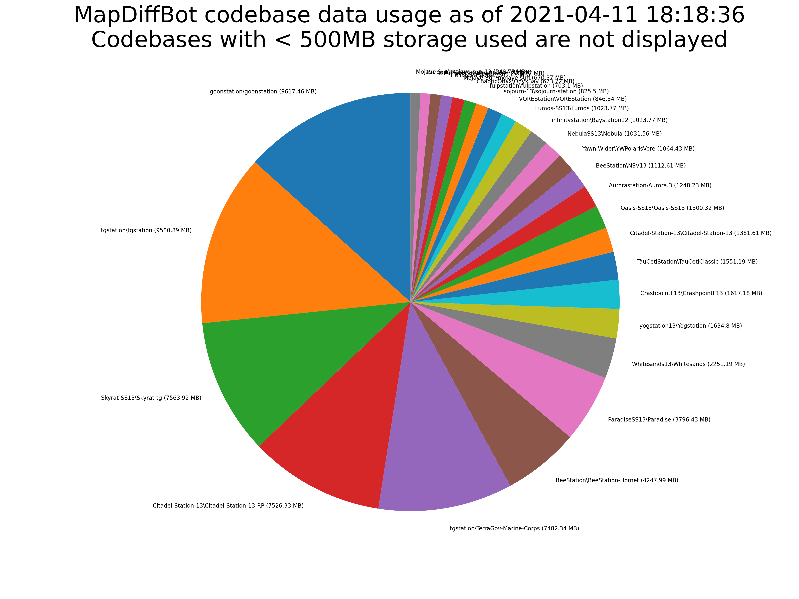

# MapDiffBot Statistics Generator

This application generates a pie-chart image for [MapDiffBot](https://github.com/tgstation/MapDiffBot) statistics based on data in the database.

## How to use

1. Copy `config.json.example` to `config.json`.
2. Fill out the respective fields.
3. Run `install.sh` to install dependencies and a python venv.
4. Run `run.sh` to run the generator. It will take a while.

## Developing

If you are editing how the chart formats, set `testing` to `true` in the config. This will use the data in `test_data.csv` instead of calls to the database and GitHub API.

## Example of a generated image

